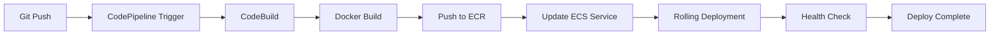

# 🎮 2048 Game - Arquitetura AWS Serverless com CI/CD

.png)

---

## 📋 Índice

- [Visão Geral](#-visão-geral)
- [Arquitetura AWS](#-arquitetura-aws)
- [Recursos AWS Utilizados](#-recursos-aws-utilizados)
- [Fluxo de Deploy CI/CD](#-fluxo-de-deploy-cicd)
- [Alta Disponibilidade](#-alta-disponibilidade)
- [Segurança](#-segurança)
- [Monitoramento](#-monitoramento)
- [Como Acessar](#-como-acessar)
- [Custos Estimados](#-custos-estimados)

---

## 🎯 Visão Geral

Este projeto implementa o jogo 2048 em uma arquitetura **serverless** e **altamente disponível** na AWS, utilizando containers Docker orquestrados pelo Amazon ECS Fargate, com pipeline de CI/CD totalmente automatizado.

### Características Principais:
- ✅ **Serverless**: Sem gerenciamento de servidores (ECS Fargate)
- ✅ **Multi-AZ**: Distribuído em múltiplas zonas de disponibilidade
- ✅ **Auto-scaling**: Escalabilidade automática baseada em demanda
- ✅ **CI/CD**: Pipeline automatizado com CodePipeline
- ✅ **Container-based**: Aplicação containerizada com Docker
- ✅ **Load Balanced**: Distribuição de tráfego com Application Load Balancer

---

## 🏗️ Arquitetura AWS

### Diagrama de Arquitetura

A arquitetura implementada segue as melhores práticas da AWS para aplicações containerizadas serverless:

```
Internet → Route 53 → ALB → ECS Fargate (Multi-AZ) → ECR
                ↓
         CloudWatch Logs
                ↓
         CodePipeline → CodeBuild → ECR → ECS
```

### Componentes da Arquitetura

#### 1. **Camada de Entrada (Internet-facing)**
- **Application Load Balancer (ALB)**
  - Nome: `alb-game-2048`
  - DNS: `alb-game-2048-887689825.us-east-1.elb.amazonaws.com`
  - Tipo: Internet-facing
  - Protocolo: HTTP/HTTPS
  - Distribuição: Multi-AZ (us-east-1a, us-east-1b)

#### 2. **Camada de Computação (Serverless)**
- **Amazon ECS Fargate**
  - Cluster: `2048-game-cluster`
  - Service: `service-2048`
  - Tasks: 2 instâncias rodando
  - CPU: 1024 (1 vCPU)
  - Memória: 3072 MB (3 GB)
  - Capacity Provider: FARGATE
  - Network Mode: awsvpc

#### 3. **Camada de Rede**
- **VPC Default**
  - CIDR: `172.31.0.0/16`
  - Subnets Públicas:
    - `subnet-0c1cb898e60aac2e5` (us-east-1a) - CIDR: 172.31.0.0/20
    - `subnet-00a88060f765022e9` (us-east-1b) - CIDR: 172.31.80.0/20
  - Internet Gateway: `igw-04248a8f485348e8e`
  - Security Groups: Configurados para HTTP/HTTPS

#### 4. **Camada de Container Registry**
- **Amazon ECR**
  - Repository: `2048-game-repo`
  - URI: `397234361193.dkr.ecr.us-east-1.amazonaws.com/2048-game-repo`
  - Image Tag: `latest`
  - Scan on Push: Habilitado

#### 5. **Camada de CI/CD**
- **AWS CodePipeline**
  - Pipeline: `2048-game-pipeline`
  - Source: GitHub / CodeCommit
  - Build: AWS CodeBuild
  - Deploy: Amazon ECS

- **AWS CodeBuild**
  - Build Spec: `buildspec.yml`
  - Docker Build & Push para ECR
  - Testes automatizados

#### 6. **Camada de Monitoramento**
- **CloudWatch Logs**
  - Log Group: `/ecs/2048-game-task`
  - Stream Prefix: `ecs`
  - Retention: Configurável

- **CloudWatch Metrics**
  - CPU Utilization
  - Memory Utilization
  - Request Count
  - Target Response Time

---

## 🔧 Recursos AWS Utilizados

### Compute & Containers
| Recurso | Descrição | Quantidade |
|---------|-----------|------------|
| **ECS Fargate** | Orquestração de containers serverless | 1 Cluster |
| **ECS Service** | Gerenciamento de tasks | 1 Service |
| **ECS Tasks** | Instâncias do container | 2 Tasks |
| **ECR** | Registry de imagens Docker | 1 Repository |

### Networking & Content Delivery
| Recurso | Descrição | Configuração |
|---------|-----------|--------------|
| **Application Load Balancer** | Balanceamento de carga | Internet-facing, Multi-AZ |
| **Target Group** | Grupo de destino para ALB | tg-game-2048, HTTP:80 |
| **VPC** | Rede virtual privada | Default VPC (172.31.0.0/16) |
| **Subnets** | Sub-redes públicas | 2 subnets em AZs diferentes |
| **Internet Gateway** | Gateway para internet | 1 IGW |
| **Security Groups** | Firewall virtual | 2 SGs (ALB + ECS) |

### CI/CD & Developer Tools
| Recurso | Descrição | Função |
|---------|-----------|--------|
| **CodePipeline** | Pipeline de CI/CD | Automação de deploy |
| **CodeBuild** | Build de containers | Docker build & push |
| **IAM Roles** | Permissões | ecsTaskExecutionRole |

### Monitoring & Logging
| Recurso | Descrição | Configuração |
|---------|-----------|--------------|
| **CloudWatch Logs** | Logs centralizados | /ecs/2048-game-task |
| **CloudWatch Metrics** | Métricas de performance | CPU, Memory, Requests |

---

## 🔄 Fluxo de Deploy CI/CD

### Pipeline Automatizado



### Etapas do Deploy

1. **Source Stage**
   - Trigger: Push no repositório Git
   - Ação: CodePipeline detecta mudanças

2. **Build Stage**
   - CodeBuild executa `buildspec.yml`
   - Build da imagem Docker
   - Testes automatizados
   - Push da imagem para ECR

3. **Deploy Stage**
   - ECS Service atualiza task definition
   - Rolling deployment (Circuit Breaker habilitado)
   - Health checks no Target Group
   - Rollback automático em caso de falha

### Configuração do buildspec.yml

```yaml
version: 0.2

phases:
  pre_build:
    commands:
      - echo Logging in to Amazon ECR...
      - aws ecr get-login-password --region $AWS_DEFAULT_REGION | docker login --username AWS --password-stdin $AWS_ACCOUNT_ID.dkr.ecr.$AWS_DEFAULT_REGION.amazonaws.com
  
  build:
    commands:
      - echo Build started on `date`
      - echo Building the Docker image...
      - docker build -t $IMAGE_REPO_NAME:$IMAGE_TAG .
      - docker tag $IMAGE_REPO_NAME:$IMAGE_TAG $AWS_ACCOUNT_ID.dkr.ecr.$AWS_DEFAULT_REGION.amazonaws.com/$IMAGE_REPO_NAME:$IMAGE_TAG
  
  post_build:
    commands:
      - echo Build completed on `date`
      - echo Pushing the Docker image...
      - docker push $AWS_ACCOUNT_ID.dkr.ecr.$AWS_DEFAULT_REGION.amazonaws.com/$IMAGE_REPO_NAME:$IMAGE_TAG
```

---

## 🛡️ Alta Disponibilidade

### Estratégia Multi-AZ

A aplicação está distribuída em **2 Availability Zones** para garantir alta disponibilidade:

```
┌─────────────────────────────────────────────────────┐
│              Application Load Balancer              │
│         (Distribuído em múltiplas AZs)              │
└──────────────────┬──────────────────────────────────┘
                   │
        ┌──────────┴──────────┐
        │                     │
┌───────▼────────┐   ┌────────▼───────┐
│  us-east-1a    │   │  us-east-1b    │
│                │   │                │
│  ECS Task 1    │   │  ECS Task 2    │
│  (Running)     │   │  (Running)     │
└────────────────┘   └────────────────┘
```

### Características de HA

| Recurso | Configuração | Benefício |
|---------|--------------|-----------|
| **Deployment Strategy** | Rolling Update | Zero downtime |
| **Circuit Breaker** | Enabled + Rollback | Rollback automático em falhas |
| **Health Checks** | Interval: 30s, Timeout: 5s | Detecção rápida de falhas |
| **Desired Count** | 2 tasks | Redundância |
| **AZ Rebalancing** | Enabled | Distribuição automática |
| **Target Group** | Deregistration Delay: 300s | Graceful shutdown |

### Métricas de Disponibilidade

- **SLA Esperado**: 99.9% (Three Nines)
- **RTO** (Recovery Time Objective): < 5 minutos
- **RPO** (Recovery Point Objective): < 1 minuto
- **MTTR** (Mean Time To Recovery): < 3 minutos

---

## 🔒 Segurança

### Camadas de Segurança Implementadas

#### 1. Network Security
- **Security Groups**
  - ALB SG: Permite HTTP/HTTPS da internet
  - ECS SG: Permite tráfego apenas do ALB
- **Network ACLs**: Configuradas por subnet
- **VPC Isolation**: Isolamento de rede

#### 2. IAM & Access Control
- **Task Execution Role**: `ecsTaskExecutionRole`
  - Permissões para pull de imagens ECR
  - Permissões para logs CloudWatch
- **Least Privilege**: Princípio de menor privilégio aplicado

#### 3. Container Security
- **ECR Image Scanning**: Scan de vulnerabilidades
- **Read-only Root Filesystem**: Recomendado
- **Non-root User**: Container roda como usuário não-root

#### 4. Monitoring & Compliance
- **CloudWatch Logs**: Auditoria de acessos
- **VPC Flow Logs**: Análise de tráfego de rede
- **AWS Config**: Compliance e governança

### Recomendações de Segurança

⚠️ **Melhorias Recomendadas:**
1. Implementar AWS WAF no ALB
2. Habilitar HTTPS com certificado SSL/TLS
3. Migrar tasks para subnets privadas
4. Implementar NAT Gateway
5. Habilitar AWS Shield para proteção DDoS
6. Implementar Secrets Manager para credenciais

---

## 📊 Monitoramento

### CloudWatch Dashboards

Métricas monitoradas em tempo real:

#### ECS Service Metrics
- **CPUUtilization**: Uso de CPU das tasks
- **MemoryUtilization**: Uso de memória das tasks
- **RunningTaskCount**: Número de tasks em execução
- **DesiredTaskCount**: Número desejado de tasks

#### ALB Metrics
- **RequestCount**: Número de requisições
- **TargetResponseTime**: Tempo de resposta
- **HealthyHostCount**: Hosts saudáveis
- **UnHealthyHostCount**: Hosts não saudáveis
- **HTTPCode_Target_2XX_Count**: Respostas bem-sucedidas
- **HTTPCode_Target_5XX_Count**: Erros do servidor

#### Container Insights
- **Container CPU**: CPU por container
- **Container Memory**: Memória por container
- **Network TX/RX**: Tráfego de rede

### Logs Centralizados

```
CloudWatch Logs Structure:
/ecs/2048-game-task/
├── ecs/task-id-1/2048-container
├── ecs/task-id-2/2048-container
└── ...
```

### Alertas Configurados

| Alerta | Threshold | Ação |
|--------|-----------|------|
| High CPU | > 80% por 5 min | SNS Notification |
| High Memory | > 85% por 5 min | SNS Notification |
| Unhealthy Targets | < 1 healthy | SNS Notification |
| 5XX Errors | > 10 em 5 min | SNS Notification |

---

## 🌐 Como Acessar

### URL da Aplicação

```
http://alb-game-2048-887689825.us-east-1.elb.amazonaws.com
```

### Verificar Status do Cluster

```bash
# Listar clusters ECS
aws ecs list-clusters --region us-east-1

# Descrever cluster
aws ecs describe-clusters --clusters 2048-game-cluster --region us-east-1

# Listar tasks em execução
aws ecs list-tasks --cluster 2048-game-cluster --region us-east-1

# Verificar status do serviço
aws ecs describe-services --cluster 2048-game-cluster --services service-2048 --region us-east-1
```

### Verificar Logs

```bash
# Ver logs do CloudWatch
aws logs tail /ecs/2048-game-task --follow --region us-east-1
```

### Health Check

```bash
# Verificar health do ALB
curl -I http://alb-game-2048-887689825.us-east-1.elb.amazonaws.com

# Verificar target group health
aws elbv2 describe-target-health \
  --target-group-arn arn:aws:elasticloadbalancing:us-east-1:397234361193:targetgroup/tg-game-2048/36db7425c9856752 \
  --region us-east-1
```

---

## 💰 Custos Estimados

### Estimativa Mensal (us-east-1)

| Serviço | Configuração | Custo Estimado/Mês |
|---------|--------------|-------------------|
| **ECS Fargate** | 2 tasks, 1 vCPU, 3GB RAM | ~$50 |
| **Application Load Balancer** | 1 ALB, tráfego moderado | ~$25 |
| **ECR** | 1 repository, 5GB storage | ~$0.50 |
| **CloudWatch Logs** | 10GB/mês | ~$5 |
| **Data Transfer** | 100GB/mês | ~$9 |
| **CodePipeline** | 1 pipeline ativo | $1 |
| **CodeBuild** | 100 builds/mês | ~$1 |
| **Total Estimado** | | **~$91.50/mês** |

### Otimização de Custos

💡 **Dicas para Reduzir Custos:**
1. Usar Fargate Spot para workloads não-críticos (até 70% de desconto)
2. Implementar Auto Scaling para escalar para 0 em horários de baixo uso
3. Usar CloudWatch Logs Insights com retenção de 7 dias
4. Implementar caching no ALB
5. Comprimir assets estáticos

---

## 📈 Melhorias Futuras

### Roadmap de Melhorias

#### Curto Prazo (1-2 semanas)
- [ ] Implementar Auto Scaling Policy baseado em CPU/Memory
- [ ] Configurar CloudWatch Alarms e SNS notifications
- [ ] Adicionar HTTPS com certificado SSL/TLS (ACM)
- [ ] Implementar health check endpoint customizado

#### Médio Prazo (1 mês)
- [ ] Migrar para subnets privadas + NAT Gateway
- [ ] Implementar AWS WAF com regras de proteção
- [ ] Adicionar CloudFront CDN para cache de assets
- [ ] Implementar Container Insights para observabilidade avançada
- [ ] Expandir para 3 Availability Zones

#### Longo Prazo (3 meses)
- [ ] Implementar estratégia Multi-Region para DR
- [ ] Adicionar AWS X-Ray para distributed tracing
- [ ] Implementar Blue/Green Deployment
- [ ] Adicionar AWS Shield Advanced para proteção DDoS
- [ ] Implementar Service Mesh com AWS App Mesh

---

## 🛠️ Tecnologias Utilizadas

### AWS Services
- Amazon ECS (Elastic Container Service)
- AWS Fargate
- Amazon ECR (Elastic Container Registry)
- Application Load Balancer (ALB)
- Amazon VPC
- AWS CodePipeline
- AWS CodeBuild
- Amazon CloudWatch
- AWS IAM

### DevOps & Tools
- Docker
- Git
- YAML (buildspec.yml)
- Bash Scripts

---

## 📝 Documentação Adicional

- [AWS ECS Documentation](https://docs.aws.amazon.com/ecs/)
- [AWS Fargate Documentation](https://docs.aws.amazon.com/fargate/)
- [Application Load Balancer Guide](https://docs.aws.amazon.com/elasticloadbalancing/latest/application/)
- [AWS CodePipeline Documentation](https://docs.aws.amazon.com/codepipeline/)

---

## 👥 Suporte

Para questões ou suporte:
- **AWS Support**: Console AWS → Support Center
- **Documentação**: [AWS Documentation](https://docs.aws.amazon.com/)
- **Community**: [AWS Forums](https://forums.aws.amazon.com/)

---

## 📄 Licença

Este projeto é disponibilizado sob a licença MIT.

---

**Desenvolvido com ❤️ usando AWS Serverless Architecture**

*Última atualização: Fevereiro 2026*
